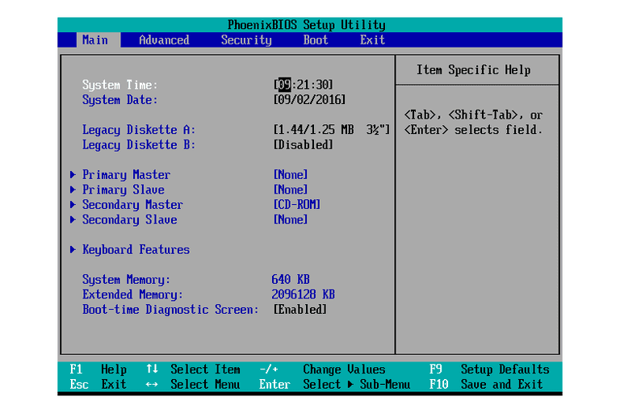
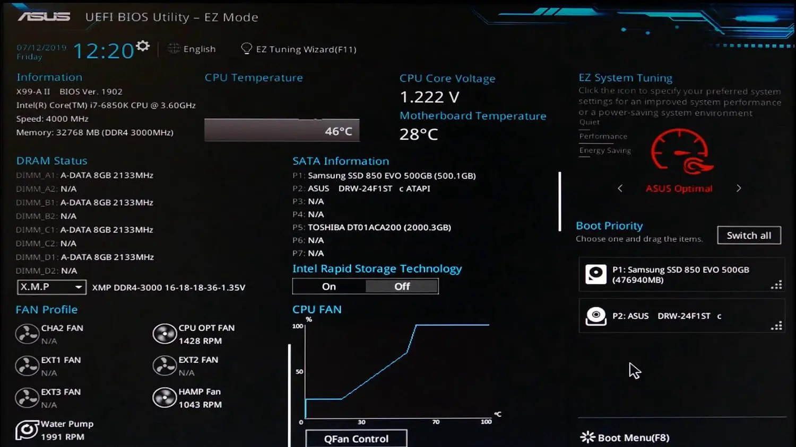
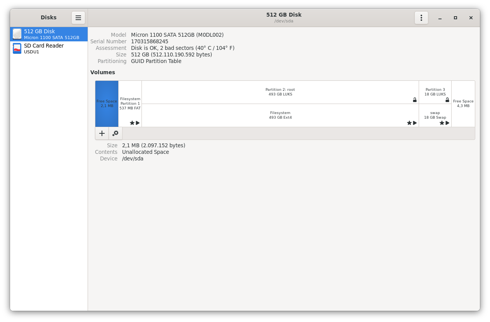
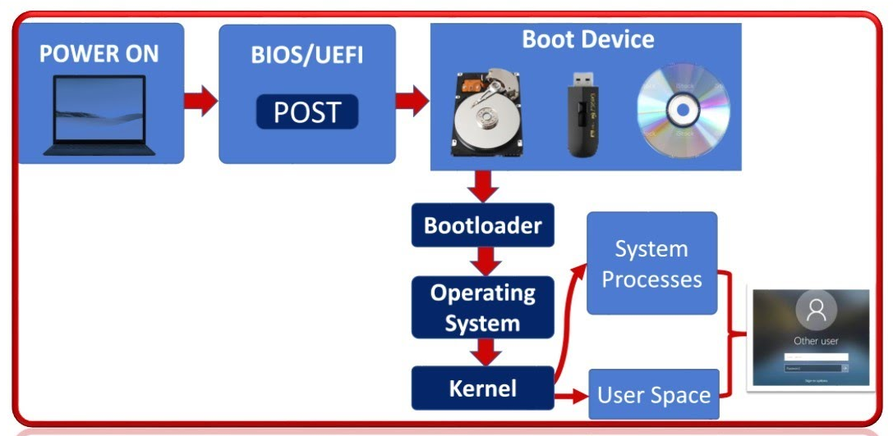

# Überblick über Geräte, BIOS, Partitionen, Betriebssysteme

---

## BIOS

**Basic Input/Output System**

- Wird beim Starten des Computers geladen
- Startet den Bootloader des Betriebssystems
- BIOS-Einstellungen werden mit einer herstellerabhängigen Tastenkombination beim Start aufgerufen.

---

---

## UEFI

**Unified Extensible Firmware Interface**

- Der Nachfolger von BIOS
- Bietet eine grafische Benutzeroberfläche
- Bietet erweiterte Sicherheitsfunktionen wie Secure Boot
- Die allermeisten Computer der letzten 10 Jahre haben UEFI.
- Relevant: Manche Betriebssysteme benötigen LEGACY-BOOT (BIOS-Kompatibilität)

---

---

## Betriebssystem

- Steuert die Hardware und führt Anwendungen aus
- Beispiele: Windows, macOS, Linux

---

## Partition

**Partitionierung von Festplatten**

- Unterteilung einer Festplatte in mehrere Abschnitte
- Ermöglicht die Installation mehrerer Betriebssysteme auf derselben Festplatte
- Beim Start des Systems wird zuerst die 1. Partition, die Boot-Partition geladen.
- Wird beim Installieren des Betriebssystems angelegt / modifiziert.
- Kann mit Programmen wie Gnome Disks oder GParted verändert werden.

---

---

## Bootprozess

**Vom Einschalten bis zum Betriebssystem**

1. **Power-On Self-Test (POST)**
2. **BIOS/UEFI Initialisierung**
3. **Bootloader laden (bei Linux meistens GRUB)**
4. **Betriebssystemkernel starten**
5. **Systemdienste und Benutzeroberfläche laden**

---

---

## Linux

**Ein freies Betriebssystem**

- Open-Source
- Weniger Ressourcenverbrauch als Windows => Läuft auch auf älteren Geräten
- Verschiedene Distributionen wie Ubuntu, Fedora, Debian, openSUSE

---

## Open Source / Freie Software

- Software, deren Quellcode öffentlich zugänglich und frei nutzbar, veränderbar und verteilbar ist.
- Entwickler sind oft Hobbyisten, aber auch viele Unternehmen veröffentlichen open-source Software.
- Beispiele: Linux, Firefox, Android (teilweise), Krita, LibreOffice

---

## TPM

**Trusted Platform Module**

- Ein Sicherheitschip auf dem Mainboard
- Speichert kryptographische Schlüssel
- Unterstützt Funktionen wie Festplattenverschlüsselung und sichere Bootprozesse

---

## Q&A?