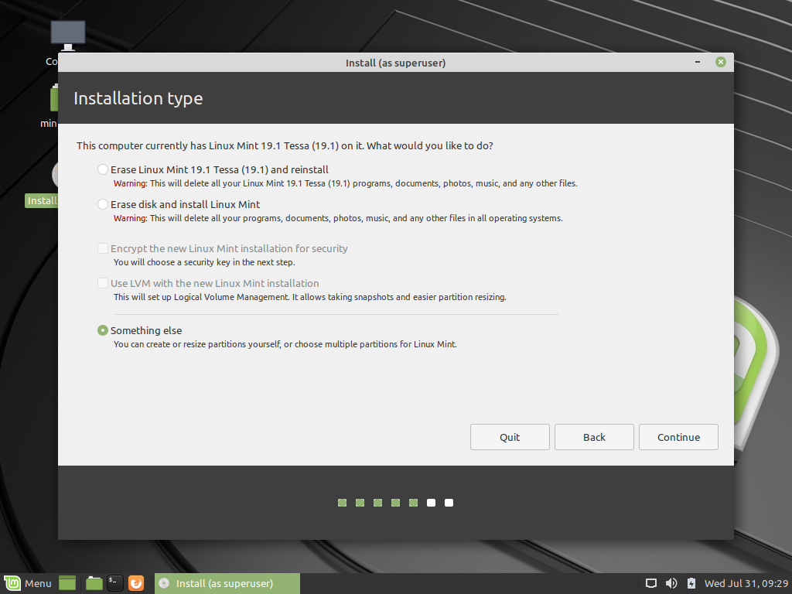
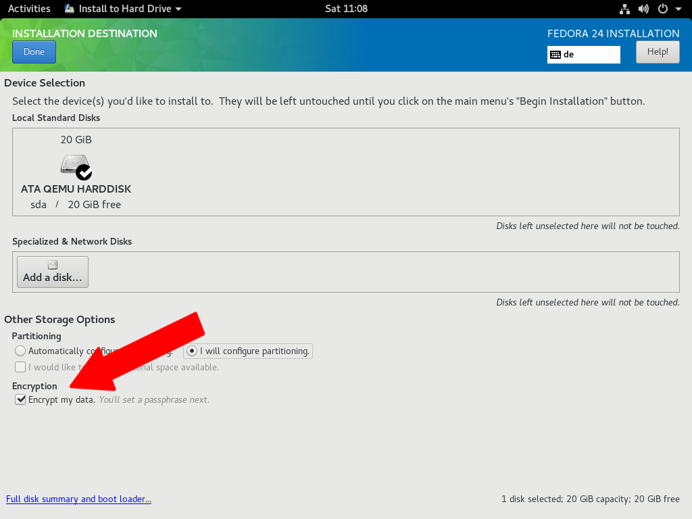
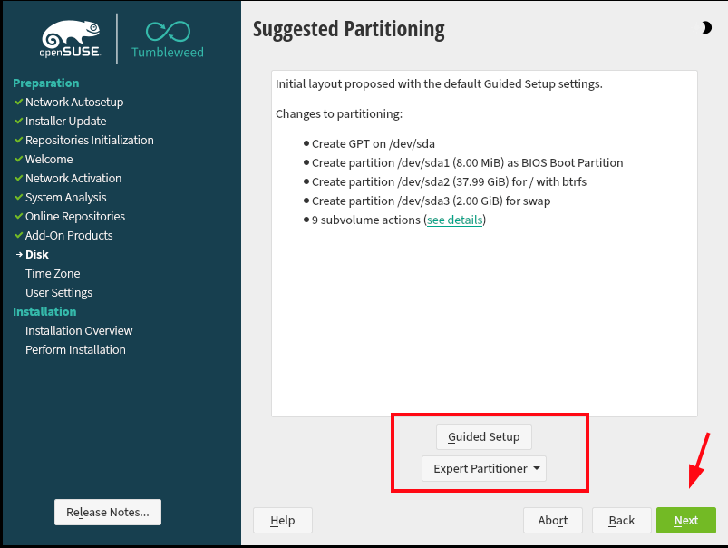
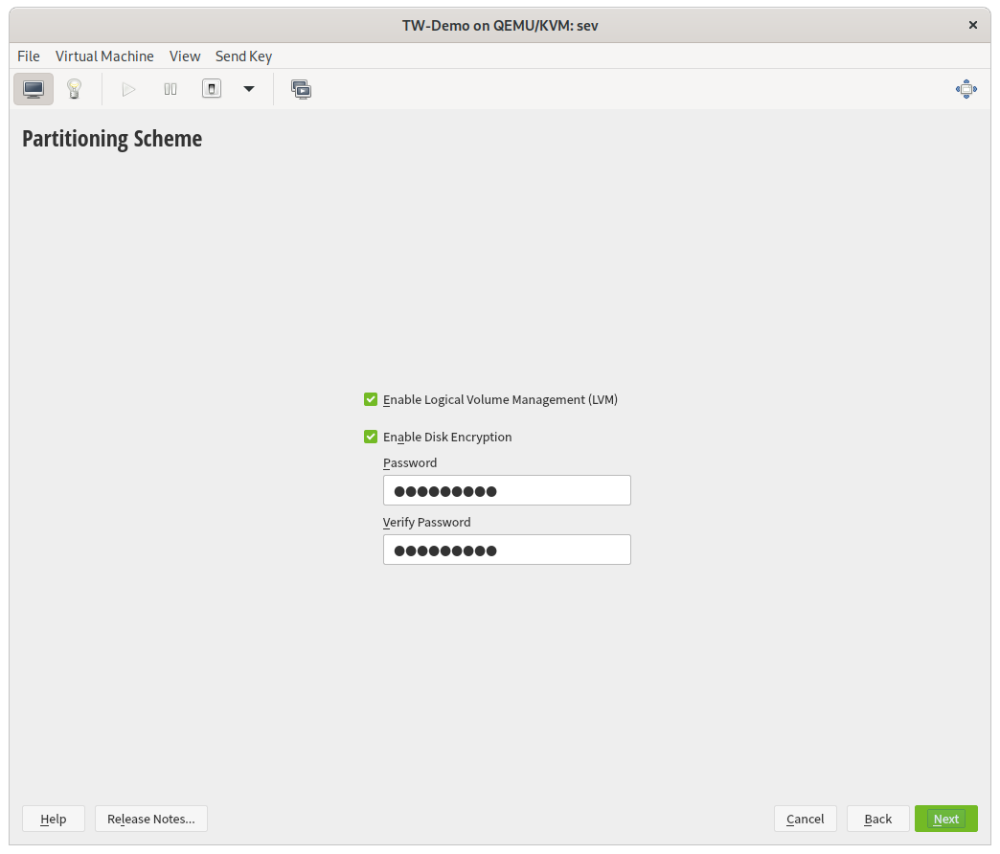
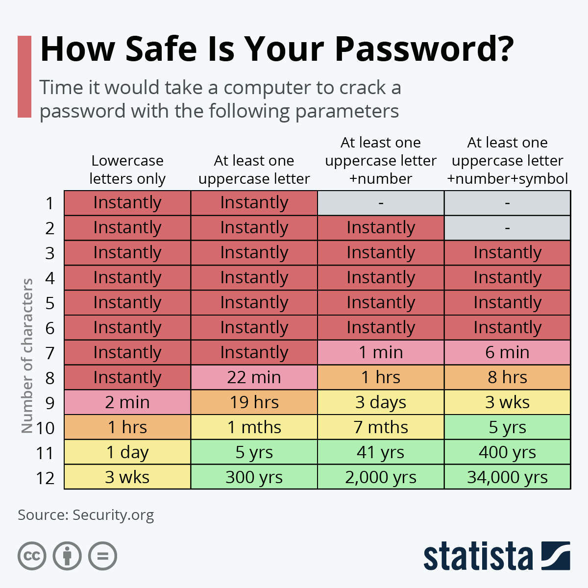

# Laptop / PC Verschlüsselung

- **Windows** und **MacOS** bieten mittlerweile Verschlüsselung;
    - aber: nicht open-source, kann teilweise durch iCloud etc. umgangen werden
- **Linux**: Verschlüsselung mit Best Practices nach heutigem Stand nicht knackbar, aber: muss manuell bei Installation ausgewählt werden

---

---

---

---

---

# Passwörter

- Passwörter können durch eine sogenannte Dictionary-Attack angegriffen werden.
=> Keine Wörter in Passwörtern, sondern zufällige Zeichen

---

---

# Secure Boot

- Secure Boot verhindert den Systemstart, wenn etwas an eurem Bootloader verändert wurde.
- Wird nur von manchen, großen Distributionen unterstützt.
    - Debian, Ubuntu, SUSE, Fedora
- Wollt ihr eine andere Distribution benutzen, müsst ihr Secure Boot im BIOS ausschalten

---

# Windows

- Verschlüsselung ist seit Windows 10 Standard
- Bei geringerem Thread-Modell vermutlich ausreichend bei starkem Passwort

---

# macOS

- Verschlüsselung muss in den Einstellungen eingeschalten werden
- Deaktiviert Option für Entschlüsselung über iCloud
- Passwort **nicht** verlieren, kann auf neuen Macs nicht ohne weiteres zurückgesetzt werden!

---

# iOS

- Verschlüsselung ist Standard und allgemein sicher
- ABER: iCloud-Backups sind für Cops einfach zugänglich
=> iCloud-Backups deaktivieren
- (und iPhones sind teuer)

---

# Android

- Verschlüsselung ist seit Android 3 verfügbar
- Bei manchen Herstellern standardmäßig an, manchmal muss Verschlüsselung in den Geräteeinstellungen angeschalten werden

---

# Exploits wie Cellebrite

- Cops haben (selten) in der Vergangenheit Android (und iOS) Verschlüsselung umgehen können.
- Für maximale Sicherheit sollte man ein aktuelles Google Pixel mit GrapheneOS benutzen
- Nachteil: Teuer
